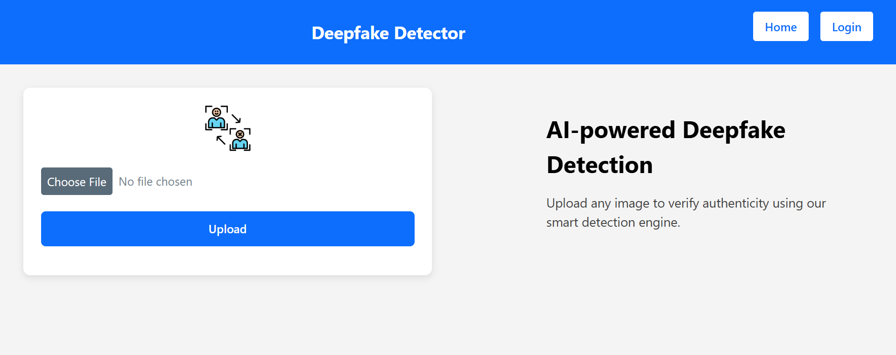
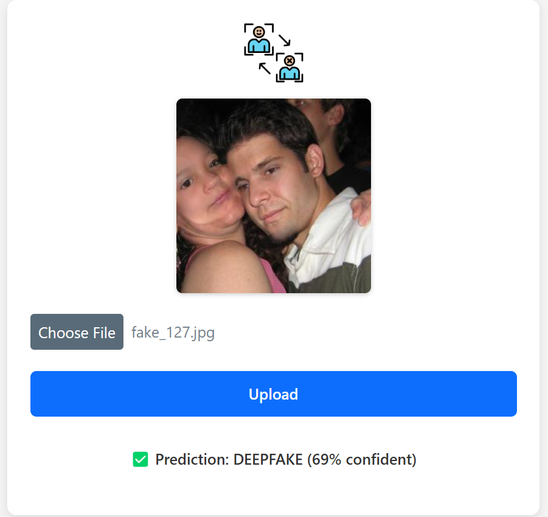

# 🧠 SachAI – Multi-Modal AI Detection Platform

## 📌 Overview

SachAI is a full-stack AI-powered misinformation detection platform designed to help users identify manipulated and misleading digital content.

The platform combines deepfake image detection, fake news verification, source credibility analysis, and explainable AI to provide a comprehensive authenticity assessment of online content.

Built using React, Node.js, Flask, TensorFlow, and custom machine learning models, SachAI delivers real-time analysis through an intuitive web interface.

---

## 🚀 Key Features

### 🎭 Deepfake Image Detection

* Detects AI-generated and manipulated facial images
* Custom CNN trained on 200,000+ real and fake images
* Real-time image analysis
* Confidence-based predictions

### 📰 Fake News Verification

* Verifies news claims using fact-checking services
* Identifies potentially misleading information
* Provides credibility insights and contextual analysis

### 🔍 Source Verification

* Evaluates source reliability
* Assesses credibility indicators
* Helps users identify trustworthy information sources

### 🧠 Explainable AI (XAI)

* Grad-CAM visualizations
* Highlights image regions influencing model decisions
* Improves transparency and interpretability

### ⚡ Real-Time Analysis

* Fast prediction pipeline
* Interactive web interface
* Immediate results with confidence scores

---

## 🎯 Problem Statement

The rapid growth of generative AI has significantly increased the spread of deepfakes and misinformation across digital platforms.

These threats impact:

* Journalism and media credibility
* Political discourse
* Public trust
* Cybersecurity
* Identity protection

SachAI aims to provide an automated and scalable solution for detecting manipulated content and supporting informed decision-making.

---

## 🏗️ System Architecture

```text
Frontend (React + Vite)
          │
          ▼
Node.js API Layer
          │
          ▼
Flask AI Services
          │
 ┌────────┼────────┐
 ▼        ▼        ▼
Deepfake  Fake     Explainable
Model     News     AI Engine
          Engine
```

---

## ⚙️ Technology Stack

### Frontend

* React.js
* Vite
* CSS
* Responsive UI Design

### Backend

* Node.js
* Express.js
* Flask
* Python

### Artificial Intelligence

* TensorFlow
* Keras
* Convolutional Neural Networks (CNN)
* Grad-CAM

### APIs & Verification

* Google Fact Check API
* External Verification Services

### Dataset

* Deepfake and Real Images Dataset
* 200,000+ Images

---

## 📂 Project Structure

```text
SachAI-Multimodal-AI-Detection/

├── frontend/
│   ├── src/
│   ├── public/
│   └── assets/
│
├── backend/
│   ├── app.py
│   ├── custom_cnn_model.h5
│   ├── fake_news_model.py
│   ├── source_verifier.py
│   ├── ai_explainer.py
│   ├── predict_utils.py
│   └── video_utils.py
│
├── screenshots/
│
└── README.md
```

---

## 📊 Model Performance

### Deepfake Detection Model

| Metric          | Value           |
| --------------- | --------------- |
| Model Type      | Custom CNN      |
| Dataset Size    | 200,000+ Images |
| Accuracy        | ~89%            |
| Prediction Time | ~2–3 Seconds    |

---

## 📸 Screenshots

### 🏠 Home Page



### 🎭 Deepfake Detection



### 📰 Fake News Verification

(Add Screenshot)

### 🧠 Explainable AI Results

(Add Screenshot)

---

## 🚀 Installation

### 1. Clone Repository

```bash
git clone https://github.com/UmReh/SachAI-Multimodal-AI-Detection.git
cd SachAI-Multimodal-AI-Detection
```

---

### 2. Start Backend

```bash
cd backend

pip install -r requirements.txt

python app.py
```

---

### 3. Start Frontend

```bash
cd frontend

npm install

npm run dev
```

---

### 4. Open Application

```text
http://localhost:5173
```

---

## 🎯 Future Enhancements

* 🎥 Video Deepfake Detection
* 🔊 Audio Deepfake Detection
* 🌐 Multi-language Fact Verification
* ☁️ Cloud Deployment
* 📱 Mobile Application
* 🤖 Advanced Transformer-Based Models

---

## 🏆 Key Achievements

* Built a complete AI-powered misinformation detection platform
* Developed a custom CNN trained on 200,000+ images
* Achieved approximately 89% deepfake detection accuracy
* Integrated multiple AI services into a single application
* Implemented explainable AI for model transparency
* Created a scalable full-stack architecture

---

## 📚 References

* TensorFlow Documentation
* Keras Documentation
* React Documentation
* Flask Documentation
* Node.js Documentation
* Google Fact Check API
* Kaggle Deepfake Dataset

---

## 👨‍💻 Author

**Umer Rehman**

B.Tech Computer Science Engineering
Jamia Hamdard

---

⭐ If you found this project interesting, consider starring the repository.
